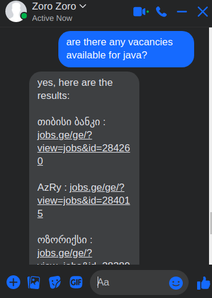

# **General**
	There should be two main flows in the application. 
	- Flow/Service that once in predefined period of time parses predefined Vacancies web pages
	  and populates database with aggregated data
	- Flow/Service using which structured data of parsed vacancies gets accesable to the user.
	  There are several ways via which users can get hands on these data. 
	  	1) Messanger Chat Bot. Interactive bot talks to user and gives him/her needed data
	  	2) Web UI
  

# **Integrated Messanger Chat bot Beta Screenshot**

